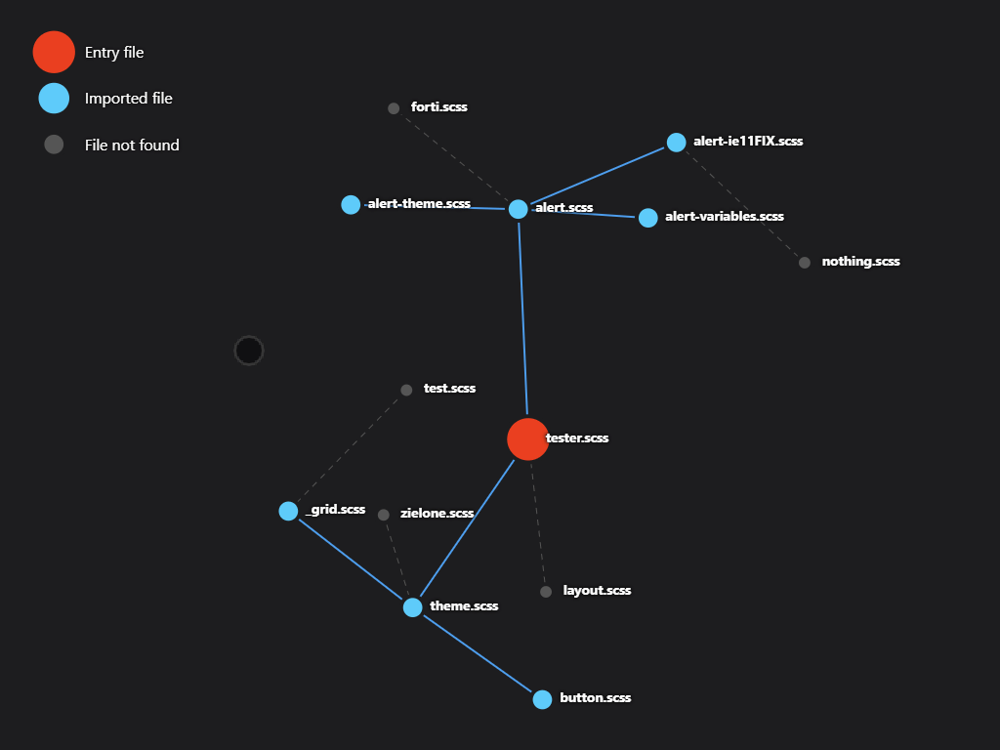

# Sass-codebase-visualizer

This tool has been created to visualize the structure of a Sass codebase.
It is consisted of two parts:
- Node.js script that reads entry file and generates a JSON file with all imported files along with their dependencies
- `index.html` file which imports JSON file and displays the structure of the codebase

## DEMO
[DEMO](https://shivero.github.io/Sass-codebase-visualizer/)

## How to use
1. Make sure you have Node.js v20 installed
2. Download file `visualizer.js` and `index.html` and place them in the same directory
3. Run `node visualizer.js [your_entry_point.scss]` in the terminal. eg. `node visualizer.js src/styles/main.scss`
4. This will generate a JSON file in the same directory as `visualizer.js` named `tree.json`
5. Open `index.html` in your browser. Webpage will automatically load the JSON file and display the structure of your codebase using d3.js library

Preview
